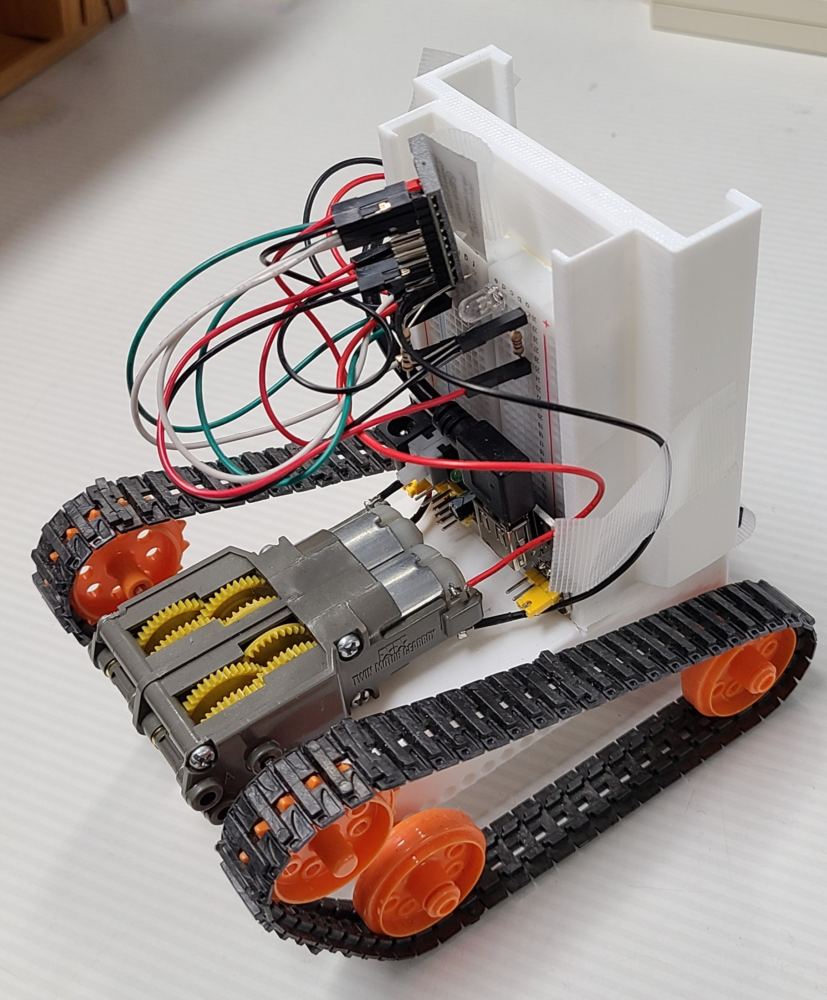
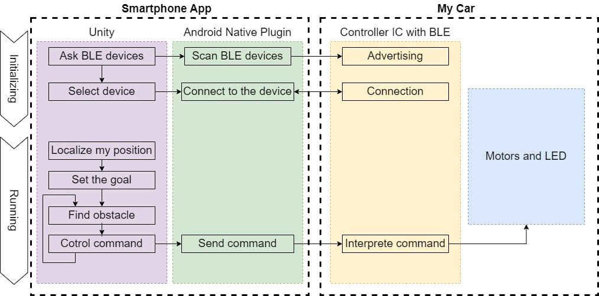
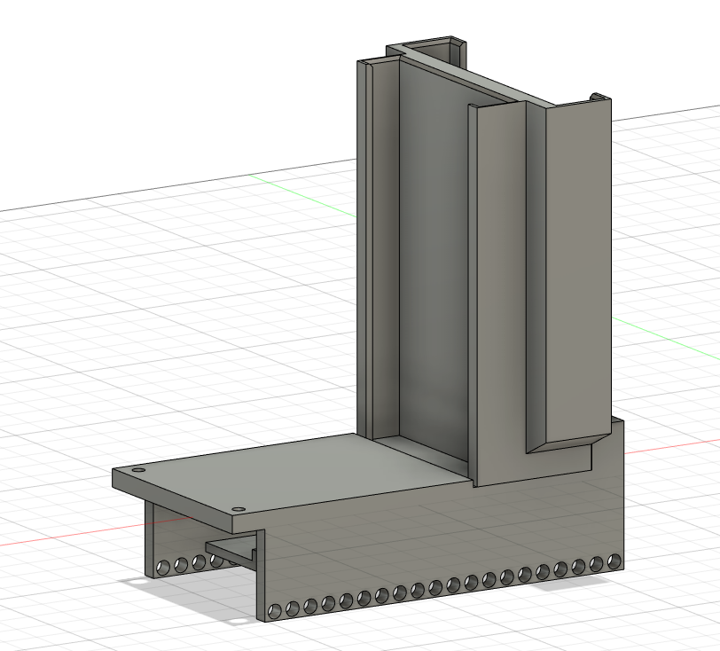
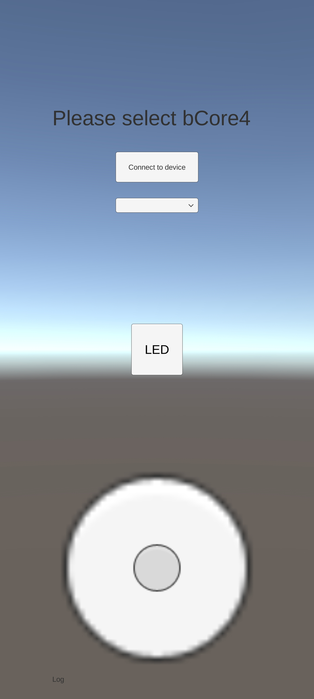
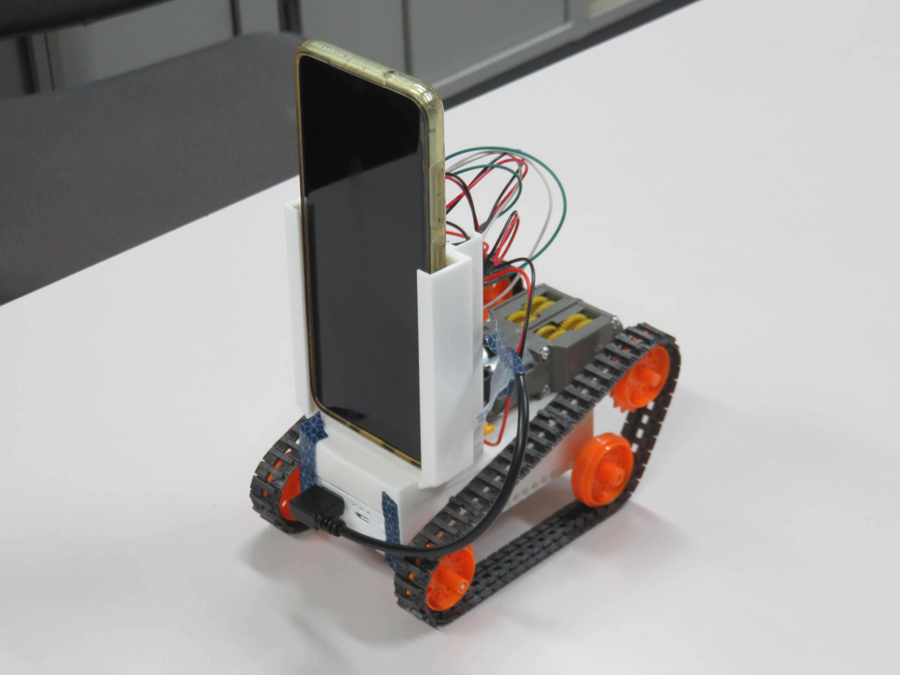

# Remote Car
目的
* 3Dプリンターの練習のために車体を設計、モデルの作成を行う。
* UnityからBluetoothを利用したワイヤレス通信を扱う。
* 久しぶりに電子工作みたいなことがしたい。

制作期間：2022年12月~2023年1月  

## 全体概要

## 車体

車体本体はAutodesk Fusion360を利用してモデリングした。  
ブレッドボード、ギヤボックス、キャタピラのシャフト、モバイルバッテリー、そして、将来的に自動運転させるためにスマートフォンも車載出来るように設計。  
3Dプリンターで印刷しやすいように2つの部品に分割した。  
Controller ICとして[bCore4](https://github.com/ymmtynk/bCore/wiki/1.7_bCore4)を利用。
Bluetooth Low Energy(BLE)での通信、モータICがセットになっていて、利用しやすい。  
モータ等の駆動部は[タミヤのツインモーターギヤボックス](https://www.tamiya.com/japan/products/70097/index.html)と[32mm径スプロケット&クローラーセット](https://www.tamiya.com/japan/products/70229/index.html)を利用。  
電源部はアマゾンで安く売っていたブレッドボード用の電源基板。モバイルバッテリーから給電するが、一般的なモバイルバッテリーは低消費電力時に止まってしまう安全装置がついているので、[cheero Canvas](https://cheero.shop/products/che-061)を利用。  

## Unity（Androidアプリ）

UnityからBLEを直接扱えないので、Android Native Pluginを作成。たぶん初めてのJava。  
Unityは主にUIの設計と自作Pluginとのやり取りを行う。  
BLE機器一覧の表示、選択、接続、前後左右移動の入力を行う。

## Android Native Plugin
UnityアプリでBLEを扱うために作成。  
BLE機器の取得、ペアリング、制御信号の送信を行う。

`unitySendMessage(String... messages)`  で
Unity内の`MessageFromPlugin()`を呼び出し。

|message header（カンマ区切り）|message内容|
|----|----|
|`LOG`|ログ|
|`CAUTION`|注意|
|`ERROR`|エラー|
|`MESSAGE`|重要なメッセージ|

`unitySendDevice(String... messages)`で
Unity内の`DeviceFromPlugin()`を呼び出し。  
`deviceName , address` の形で一件ずつ送られて来る。Unity側でリスト化。

`getVatteryVoltage`でUnity内の`ReturnBatteryVoltage()`を呼び出し。

## 今後
スマートフォンを車載し、そのカメラやセンサを入力にした自動運転車を作りたい。  
専用のカメラを利用したり高性能なマイコンを載せたりするよりも、スマートフォンをロボットの眼や頭脳に出来た方がコスト的にも、計算性能や自由度的にも高いのではないかと考えた。物体認識等のDeep Learningを載せることもできる。こんなお遊びのためにJetsonなどのエッジAI機器を用意するのはまだまだ敷居が高い。

